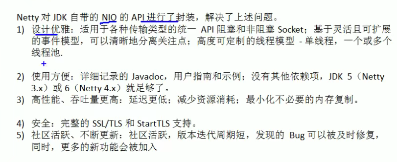
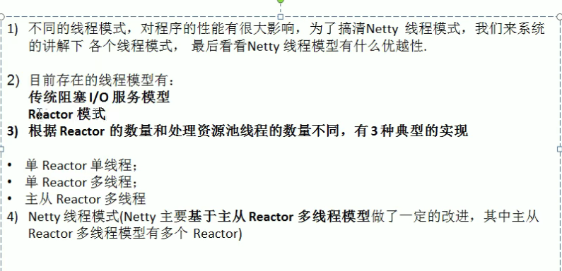
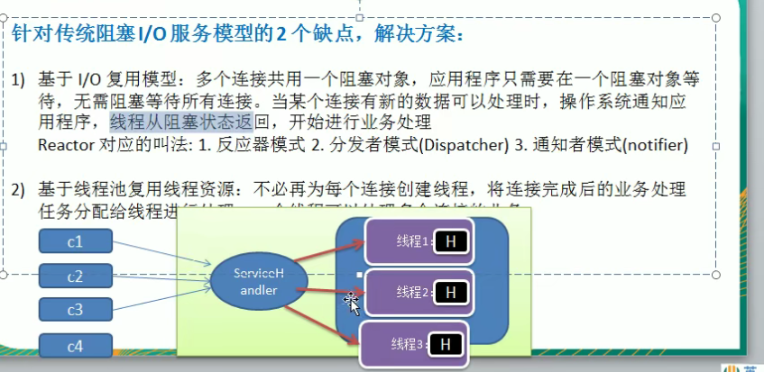
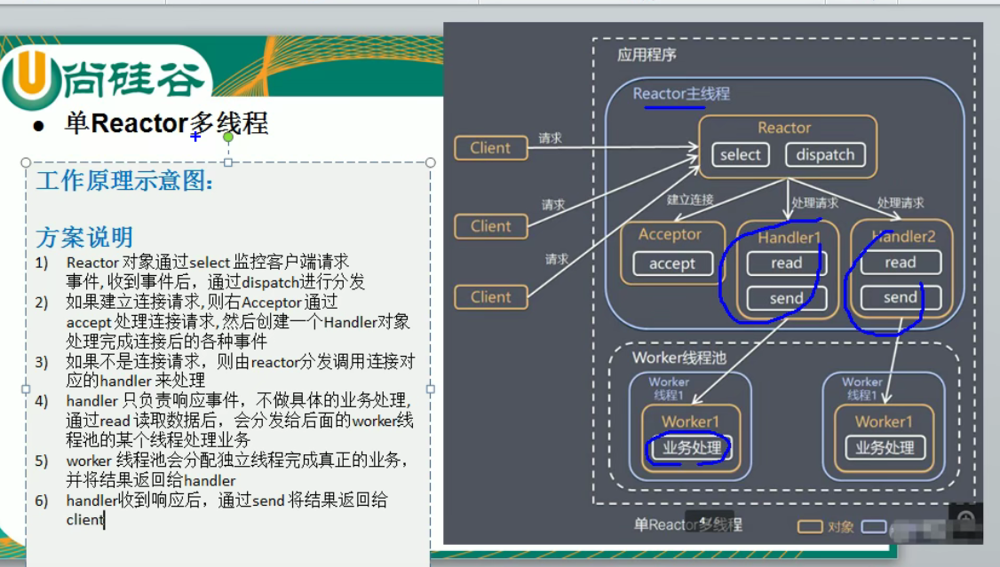
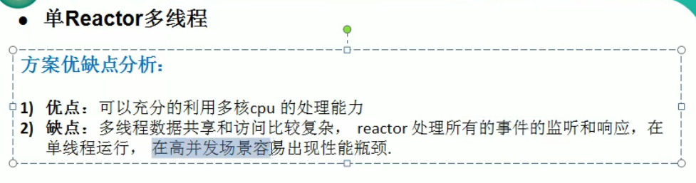
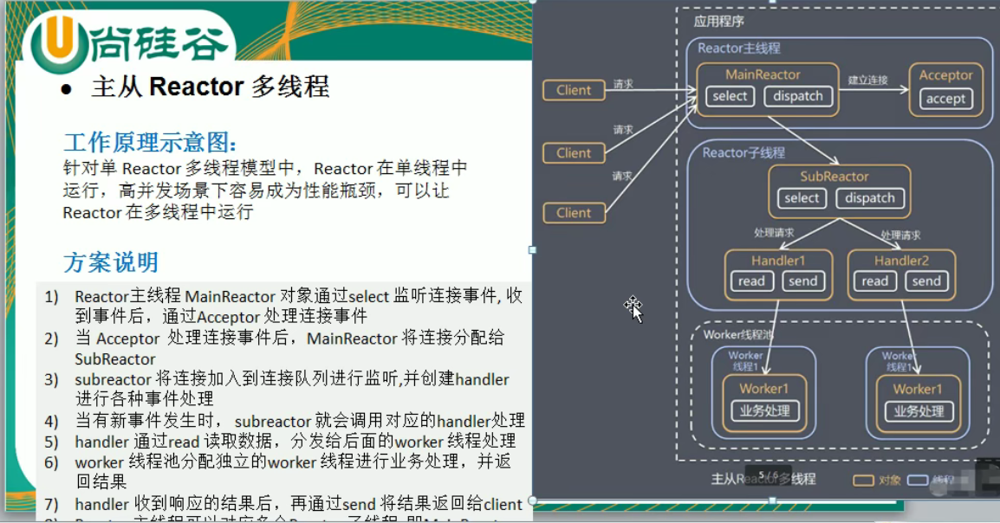
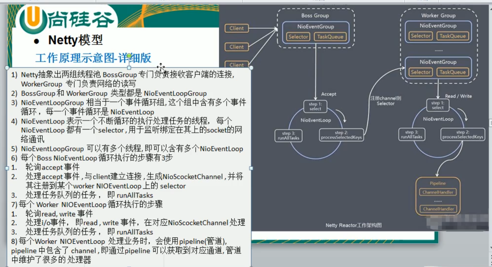

netty 是一个异步的  基于事件驱动的网络应用框架 
    他可以快速的开发  服务端和客户端

    特点： 
        1.零拷贝 
        2.只要浏览器支持
        3. 他对很多协议和服务都是支持的

netty线程模型

    1.通过一个或多个输入请求同时传递给服务处理器的模式， ‘基于事件的’
    2.服务器端程序 处理传入的 多个请求，并将他们同步‘分派’到相应的线程处理。 
        因此 ，Reactor模式也叫 Dispatcher（分发者模式）模式
    3.Reactor 模式使用IO复用监听事件
        收到事件后，分发给某个线程（也有可能是进程），这点就是网络服务高并发处理的关键。
    

单Reactor 多线程
     worker 线程处理完事件后，会把结果返回给handler   然后，通过handler的send 将对应的结果返回给客户端
        handler肯定会持有与客户端的连接（通道）
 
    优缺点：
        

主从reactor 多线程 
    

