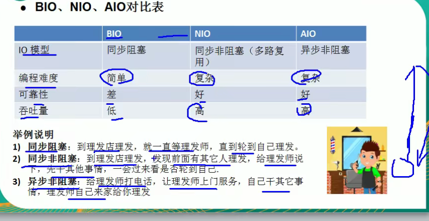

DMA 拷贝：
    直接使用内存拷贝  不使用cpu

mmap 内存映射技术：

linux 2.1 零拷贝是从操作系统角度看的，是没有cpu拷贝的。  dma拷贝无法避免

linux2.4 其实还是有一次cpu拷贝的，从kernel->socket buffer ，但是
        拷贝的信息很少，比如length offset ，消耗低  可以忽略

mmap 适合小数据量  sendfile 适合大数据量 

